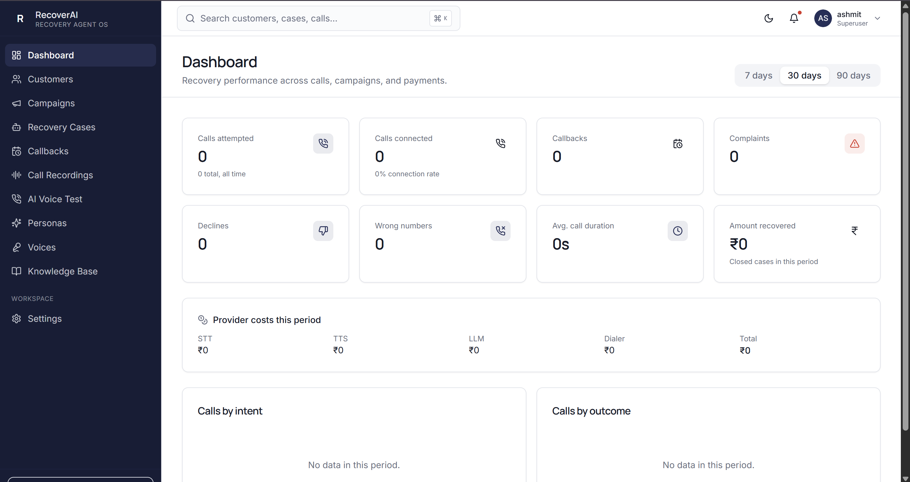
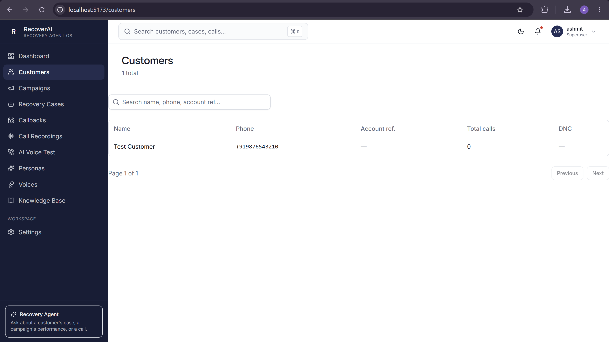
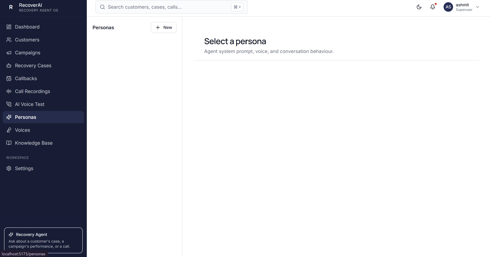
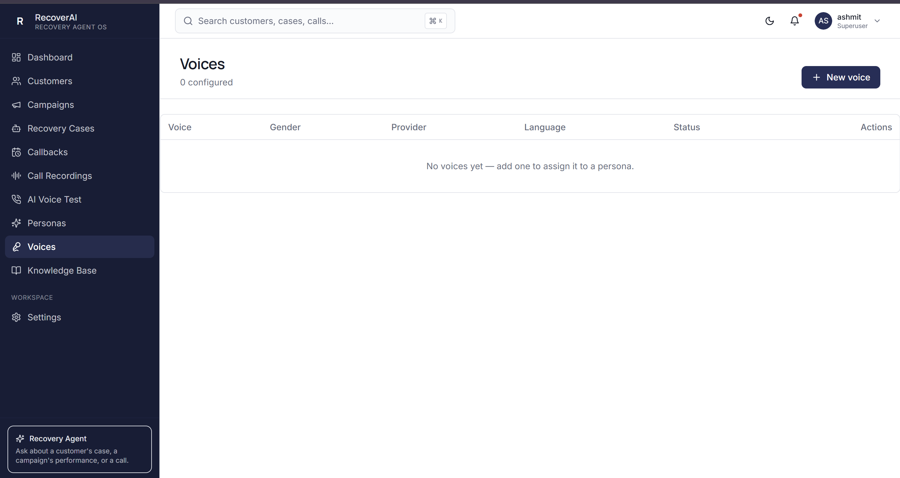
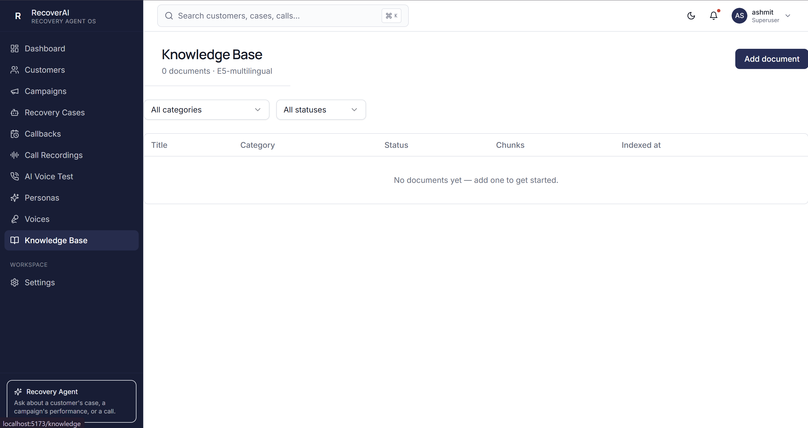

# RecoverAI — Voice-Native Revenue Recovery Agent

> An outbound AI voice agent that calls customers about outstanding payments, understands what they say, negotiates like a human recovery agent would, and never touches a payment record it hasn't verified.

RecoverAI isn't a script reader. It's a real-time conversational agent — speech in, speech out, sub-second — that classifies *intent* (payment_done, promise_to_pay, dispute, hardship, refusal...), keeps that separate from *action* (verify_payment, schedule_callback, create_dispute) and separate again from *outcome* (what actually got recorded), because collapsing those three into one thing is exactly how naive voice bots make a promise the database never sees.

<p align="center">
  
</p>

---

## Table of contents

- [What this actually is](#what-this-actually-is)
- [Architecture](#architecture)
- [The call flow, end to end](#the-call-flow-end-to-end)
- [Data model](#data-model)
- [Screenshots](#screenshots)
- [Tech stack](#tech-stack)
- [Running it locally](#running-it-locally)
- [Seeding demo data](#seeding-demo-data)
- [Feeding the Knowledge Base](#feeding-the-knowledge-base)
- [Known limitations](#known-limitations)

---

## What this actually is

Most "AI collections" demos are a phone tree with an LLM bolted on for small talk. RecoverAI's actual bet is architectural: **the LLM never gets to be the source of truth.**

When a customer says *"maine payment kar diya"* (I've already paid), the agent doesn't just believe them and mark the case closed. That sentence is classified as an **intent** (`payment_done`), which triggers an **action** (`verify_payment`, a real call to the payment provider/CRM), which produces an **outcome** (`payment_verified` or not) — and only the outcome updates the database. The customer's words are a signal, not a command.

```
Customer speech
      │
      ▼
Intent classifier   →  "what did they just say?"
      │
      ▼
RecoveryService      →  "what do we actually do about it?"
      │
      ├── PaymentService    (verify, never fabricate)
      ├── CallbackService   (only on explicit request)
      ├── RAG / Knowledge   (policy-grounded answers)
      └── Controlled Tools  (the ONLY way the DB changes)
      │
      ▼
Outcome              →  "what actually happened?"
      │
      ▼
LLM response + TTS   →  spoken back to the customer
```

This is also why the system prompt is explicit that the agent must **never invent a payment link, never invent a payment status, never threaten, and ask at most one question per turn** — those aren't personality flourishes, they're the same "verified state over LLM belief" principle applied to language, not just data.

---

## Architecture

```
┌─────────────────────────────┐        ┌──────────────────────────────┐
│   React + Vite frontend     │        │        Django backend        │
│   (this admin console)      │        │                              │
│                              │◄──────►│  REST API  (session-cookie   │
│  shadcn/ui + Tailwind        │  HTTPS │  auth, DRF)                  │
│  TanStack Query              │        │                              │
│                              │        │  Channels / Daphne  (ASGI)   │
│  Browser mic ──────────────┐│        │  WebSocket voice pipeline    │
│  AudioWorklet (PCM16) ◄─────┼┼───────►│                              │
└──────────────────────────────┘  WS    │  STT → Intent → Recovery     │
                                          │  Service → Tools → LLM →     │
                                          │  TTS → PCM16 back to client  │
                                          │                              │
                                          │  PostgreSQL/SQLite           │
                                          │  Redis (session state,       │
                                          │         runtime config)      │
                                          │  ChromaDB (RAG vector store) │
                                          └──────────────────────────────┘
                                                     │
                                          ┌──────────┴──────────┐
                                          │   External providers │
                                          │  Murf (TTS) · STT     │
                                          │  Gemini/OpenAI (LLM)  │
                                          │  Plivo (telephony)    │
                                          └───────────────────────┘
```

**Why two transports (REST + WebSocket)?** The admin console — everything you're looking at in this README's screenshots — is a normal REST/JSON app: Customers, Campaigns, Recovery Cases, Personas, all standard CRUD over `fetch`. But an actual phone conversation can't be REST — it's a continuous stream of audio in both directions with sub-second latency requirements, so that one piece (`/api/voice/ws/audio`) is a persistent WebSocket carrying raw 16-bit PCM audio frames, handled by Django Channels instead of a normal view.

---

## The call flow, end to end

1. **A call starts** — either a real outbound call (Plivo dials a customer, `dialer.py` bridges the audio), or a **Voice Test** sandbox call from this admin console (browser mic straight to the same WebSocket consumer, no real customer touched — see below).
2. **Audio in** → STT service transcribes the customer's speech, using phrase hints tuned for recovery vocabulary (payment, बकाया, EMI, dispute, promise) instead of generic dictation.
3. **Transcript → Intent classifier** → structured output: `{"intent": "promise_to_pay", "confidence": 0.96, "entities": {"promise_date": "2026-09-15"}}`. Never free-text improvisation from here on.
4. **RecoveryService** decides what actually happens — this is the one place business logic lives. It calls `PaymentService`/`CallbackService`/RAG as needed, and is the only thing allowed to call the **controlled tools** (`record_payment_promise`, `schedule_callback`, `create_payment_dispute`, `end_call`...).
5. **LLM turn** — given the verified context (never customer-claimed data), the LLM composes what to actually say, grounded by RAG when the question is policy-shaped ("can I pay in installments?").
6. **TTS → audio out**, streamed back over the same WebSocket as PCM16, played through an `AudioWorkletProcessor` on the browser side (or straight into the Plivo audio bridge for a real call) — chosen specifically so mid-sentence barge-in (the customer interrupting) can cut playback instantly instead of waiting for a full TTS clip to finish.
7. **Every turn is logged** as a `ConversationTurn`, every state-changing moment as a `RecoveryEvent` — an immutable audit trail, separate from the mutable "current state" fields on `RecoveryCase`/`PaymentRecord`.

### The Voice Test sandbox (this admin console's "AI Voice Test" page)

Pick any persona you've configured, click **Start test call**, talk to it through your mic. This exercises the *exact same* STT → Intent → LLM → TTS pipeline as a real call — same code path — but with one deliberate difference: no `Customer`, `CallSession`, or `RecoveryCase` row is ever created, and the LLM isn't handed any state-mutating tools. It's there so you can iterate on a persona's tone, opening line, and escalation behavior without a phone call, a real customer, or any database risk. That's the page to lead with in a demo — it's the fastest way to *prove* the AI actually works, live, without needing Plivo billing or a real phone number.

---

## Data model

Thirteen models, five natural clusters:

| Cluster | Models | What it answers |
|---|---|---|
| **Who** | `Customer` | Who is this? |
| **Why we're calling** | `RecoveryCampaign`, `RecoveryCase` | Which outreach effort, what's owed |
| **What happened** | `CallSession`, `ConversationTurn` | Every call, every turn of every call |
| **Ground truth** | `PaymentRecord`, `PaymentEvent` | What's actually been paid (never the LLM's word) |
| **Process** | `RecoveryEvent`, `Callback` | Immutable audit trail + scheduled follow-ups |
| **Configuration** | `LLMSetting` (persona), `TTSVoice`, `KnowledgeDocument`, `ServiceErrorLog` | How the agent behaves, sounds, knows, and fails |

```
Customer ──┬── RecoveryCase ──┬── PaymentRecord ── PaymentEvent
           │                  ├── Callback
           │                  └── RecoveryEvent
           └── CallSession ──── ConversationTurn
                    │
                    └── RecoveryEvent

LLMSetting ── (voice) ──► TTSVoice
KnowledgeDocument  (independent — RAG source, not linked to a case)
```

`RecoveryCase` is deliberately the center of gravity, not `Customer` — a customer can have multiple cases across time, and "who they are" should never get tangled with "what we currently owe-track for them."

---

## Screenshots

| Dashboard | Customers |
|---|---|
|  |  |

| Personas | Voices |
|---|---|
|  |  |

| Knowledge Base |
|---|
|  |

---

## Tech stack

**Frontend** — React 18 + TypeScript + Vite · Tailwind + shadcn/ui · TanStack Query · React Router · Web Audio API / AudioWorklet for the voice pipeline.

**Backend** — Django + Django REST Framework (admin/session API) · Django Channels + Daphne (ASGI, WebSocket voice pipeline) · Redis (session state, runtime config) · SQLite (swap for Postgres in production) · ChromaDB (RAG vector store, E5-multilingual embeddings).

**External providers** — Murf (TTS) · STT provider configured via `.env` · Gemini / OpenAI / Krutrim / BharatRouter (LLM, pluggable per persona) · Plivo (outbound telephony).

---

## Running it locally

### Prerequisites
- Python 3.11+, Node 18+, Redis running locally, an activated virtualenv for the backend.

### 1. Backend

```bash
cd Voice-bot
python -m venv venv1
venv1\Scripts\activate          # Windows
# source venv1/bin/activate     # macOS/Linux

pip install -r requirements.txt
```

Create a `.env` in the backend root (see `settings.py` for every key it reads — at minimum you need one LLM provider key, one STT key, `MURF_API_KEY` for voice, and `REDIS_URL` if it's not on the default `localhost:6379`):

```env
DJANGO_SECRET_KEY=change-me
DJANGO_DEBUG=True
GEMINI_API_KEY=...
MURF_API_KEY=...
STT_API_KEY=...
REDIS_URL=redis://localhost:6379/0
```

```bash
python manage.py migrate
python manage.py createsuperuser      # single admin — no signup flow
python manage.py runserver
```

Confirm it's alive: `GET http://127.0.0.1:8000/api/health/`

### 2. Frontend

```bash
cd Recoverai-frontend
npm install
npm run dev
```

Open `http://localhost:5173` — Vite's dev server proxies `/api/*` to `127.0.0.1:8000`, so the browser only ever talks to one origin and the Django session cookie survives without any CORS gymnastics.

Sign in with the superuser you just created — there's no separate signup page, on purpose (single-admin MVP).

### 3. First things to configure, in order

1. **Voices** — add at least one, with a real `provider_voice_id` from your TTS provider's dashboard (not a placeholder).
2. **Personas** — create one, write its system prompt/opening line, assign the voice from step 1, mark it Active.
3. **AI Voice Test** — pick that persona, click Start, talk to it. This is the fastest way to confirm every provider key in your `.env` is actually working, before you touch a real phone number.

---

## Seeding demo data

An empty dashboard (all zeros) demos badly — the charts have nothing to draw and every list says "no data yet." Before recording anything, seed a handful of rows so the UI actually has shape:

- **3–5 `Customer` rows** with realistic (fake) names and Indian phone numbers.
- **1–2 `RecoveryCampaign` rows** (e.g. "Late Payment — September", status `active`).
- **5–8 `RecoveryCase` rows** spread across those customers/campaigns, with a mix of `status` values (`open`, `promise_recorded`, `closed`) and non-zero `amount_due`/`amount_recovered`, so the Dashboard's "Amount recovered" KPI and the by-outcome chart aren't blank.
- **2–3 `CallSession` + `ConversationTurn` rows** with a real `intent`/`recovery_outcome` set, so Call Recordings and the Dashboard's "by intent" chart have something to show (a recording file isn't required for the row to display — only the audio player needs one).
- **1–2 `Callback` rows**, mixed `status`.

The cleanest way: a `python manage.py shell` script or a small management command that creates these directly via the ORM — faster and more reliable right now than trying to generate this by walking through the UI form-by-form with an hour left on the clock.

---

## Feeding the Knowledge Base

`KnowledgeDocument` is keyed by `category`, not by dealer/branch (there is no dealer/branch in this system). Add one document per category your persona should be able to answer questions about — this is what makes "can I pay in installments?" get a grounded, policy-correct answer instead of an LLM guess. Suggested minimum set for a demo:

| Category | What to write |
|---|---|
| `payment_methods` | Which payment methods are accepted (UPI, bank transfer, card link) |
| `late_payment` | What happens if a payment is late — grace period, any fee, tone to use |
| `promise_to_pay` | How a promise date gets recorded, what happens if it's missed |
| `hardship` | What options exist for genuine financial hardship (partial payment, extended timeline) — the thing your persona should offer instead of pressuring |
| `dispute` | How a disputed charge gets escalated, what the customer should expect next |
| `communication_policy` | Tone rules: no threats, respectful language, do-not-call handling |

Two or three sentences per document is enough for a demo — the point is proving RAG retrieval actually changes what the agent says, not writing a legal policy manual. Add these through the Knowledge Base page's "Add document" button.

---

## Known limitations

- **Outbound Plivo calling requires a funded/verified Plivo account** — trial accounts can only call verified numbers and will reject with a 402 otherwise. The Voice Test sandbox is unaffected by this (it never touches Plivo).
- **Single-admin auth** — session-cookie based, matches Django's own admin. No multi-user roles yet.
- **`CALL_TIMEOUT`/`MAX_CALL_DURATION` are editable from Settings**, stored in Redis — confirm whatever places real calls actually reads from there rather than the old hardcoded `settings.py` constants.
